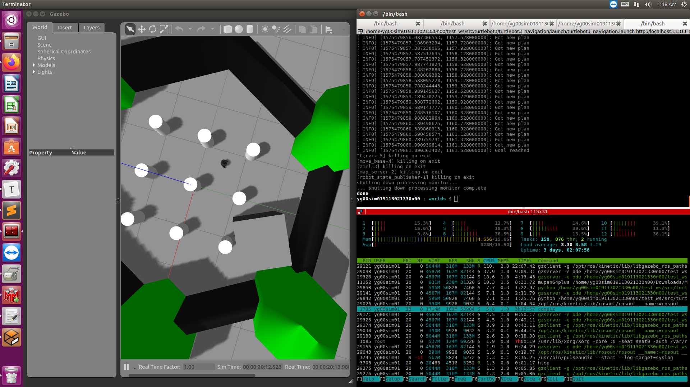

## turtlebot3安装

- 安装turtlebot3依赖包：

```
   $ sudo apt-get install ros-kinetic-joy ros-kinetic-teleop-twist-joy ros-kinetic-teleop-twist-keyboard ros-kinetic-laser-proc ros-kinetic-rgbd-launch ros-kinetic-depthimage-to-laserscan ros-kinetic-rosserial-arduino ros-kinetic-rosserial-python ros-kinetic-rosserial-server ros-kinetic-rosserial-client ros-kinetic-rosserial-msgs ros-kinetic-amcl ros-kinetic-map-server ros-kinetic-move-base ros-kinetic-urdf ros-kinetic-xacro ros-kinetic-compressed-image-transport ros-kinetic-rqt-image-view ros-kinetic-gmapping ros-kinetic-navigation ros-kinetic-interactive-markers
```

- 安装turtlebot3源码

```
$ cd ~/catkin_ws/src/
$ git clone https://github.com/ROBOTIS-GIT/turtlebot3_msgs.git
$ git clone https://github.com/ROBOTIS-GIT/turtlebot3.git
$ cd ~/catkin_ws && catkin_make
```

- 环境设置

```
$ echo "source ~/catkin_ws/devel/setup.bash" >> ~/.bashrc
```

### Turtlebot3入门教程-仿真**

**说明：**

- 介绍如何利用turtlebot3进行仿真
- 测试环境：Ubuntu 16.04 和 ROS Kinetic Kame.

**结构图：**


**注意：**

- TurtleBot3 Simulation 依赖 turtlebot3

**步骤：**

- 安装TurtleBot3 Simulation

```
cd ~/catkin_ws/src/
git clone https://github.com/ROBOTIS-GIT/turtlebot3_simulations.git
cd ~/catkin_ws && catkin_make
```

- 启动仿真

```
export TURTLEBOT3_MODEL=burger
roslaunch turtlebot3_fake turtlebot3_fake.launch
```

- TurtleBot3 仿真节点不依赖实体机器人，也可以在rviz里通过teleop节点进行控制。

```
roslaunch turtlebot3_teleop turtlebot3_teleop_key.launch
```

**Gazebo仿真**

- 第一次使用gazebo需要比较长的时间加载模型，也可以加载模型，参考
- 第一次使用Turtlebot3的gazebo仿真，需要把Turtlebot3的模型文件，复制到gazebo的模型目录里

```
mkdir -p ~/.gazebo/models/
cp -r  ~/catkin_ws/src/turtlebot3_simulations/turtlebot3_gazebo/worlds/turtlebot3 ~/.gazebo/models/
```

- 设置模型参数，指定使用那种机器人型号：burger 或者waffle

```
export TURTLEBOT3_MODEL=burger
```

- 启动世界地图，默认的空白地图环境中加载Turtlebot3机器人

```
roslaunch turtlebot3_gazebo turtlebot3_empty_world.launch
```

- 效果：


- 启动更复杂些的地图

```
roslaunch turtlebot3_gazebo turtlebot3_world.launch
```

- 效果：


- 用键盘控制turtlebot3

```
roslaunch turtlebot3_teleop turtlebot3_teleop_key.launch
```

- 启动仿真

```
export TURTLEBOT3_MODEL=burger
roslaunch turtlebot3_gazebo turtlebot3_simulation.launch
```

- 启动RVIZ可视化

```
export TURTLEBOT3_MODEL=burger
roslaunch turtlebot3_gazebo turtlebot3_gazebo_rviz.launch
```

- 效果：


