# 20191211


## 1. 分支合并

pv->lidar_forklift

lidar_forklift->pv


## 2. dns设置

dns：域名系统（服务）协议，主要用于域名与 IP 地址的相互转换，以及控制因特网的电子邮件的发送。

域名系统(Domain Name  System,DNS)是Internet上解决网上机器命名的一种系统。就像拜访朋友要先知道别人家怎么走一样，Internet上当一台主机要访问另外一台主机时，必须首先获知其地址，TCP/IP中的IP地址是由四段以“.”分开的数字组成，记起来总是不如名字那么方便，所以，就采用了域名系统来管理名字和IP的对应关系。

更改配置文件/etc/network/interfaces 以DHCP 方式配置网卡  auto eth0  iface eth0 inet dhcp 如图所示

[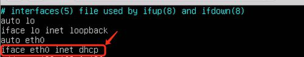](http://jingyan.baidu.com/album/9113f81b7995df2b3214c702.html?picindex=1)

重新启动网卡，看是否可以生效 /etc/init.d/networking 如下图并没有成功

[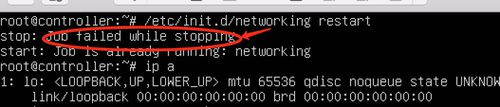](http://jingyan.baidu.com/album/9113f81b7995df2b3214c702.html?picindex=2)

如果上述命令重启失败，可以使用ifdown 网卡名称  启动网卡ifup 网卡名称

[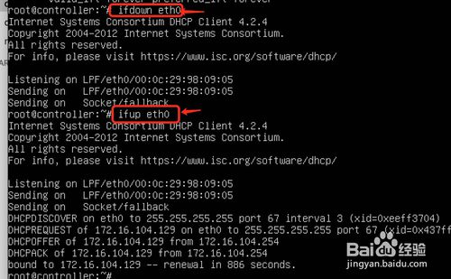](http://jingyan.baidu.com/album/9113f81b7995df2b3214c702.html?picindex=3)

为网卡配置静态IP地址sudo vi /etc/network/interface  如图所示

[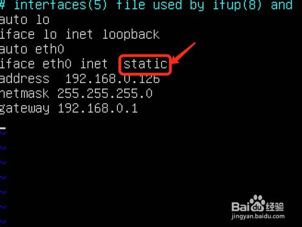](http://jingyan.baidu.com/album/9113f81b7995df2b3214c702.html?picindex=4)

要给主机配置dns有两种方法，直接在网卡配置文件中加上dns-nameservers 114.114.114.114 如图所示

[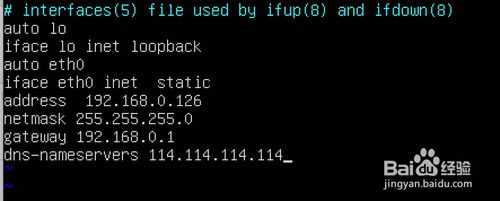](http://jingyan.baidu.com/album/9113f81b7995df2b3214c702.html?picindex=5)

配置dns第二方法，更改/etc/resolv.conf 如图所示

[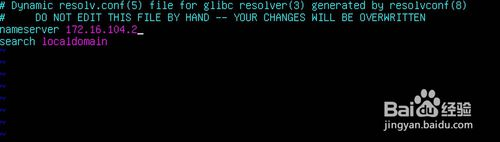](http://jingyan.baidu.com/album/9113f81b7995df2b3214c702.html?picindex=6)

设置主机名称(hostname) 使用下面的命令来查看当前主机的主机名称可以临时命令hostname 主机名称

[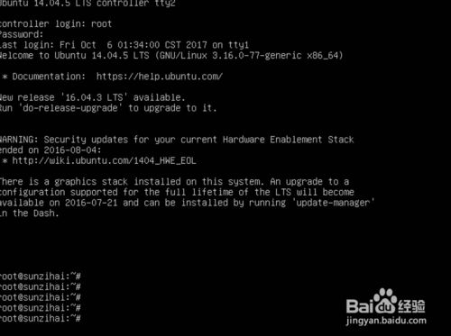](http://jingyan.baidu.com/album/9113f81b7995df2b3214c702.html?picindex=7)

设置主机名称(hostname) 使用下面的命令来查看当前主机的主机名称可以永久更改名称配置文件 vi /etc/hostname 如图所示

[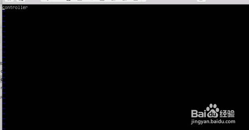](http://jingyan.baidu.com/album/9113f81b7995df2b3214c702.html?picindex=8)

## 3.设置永久dns的IP

1. 查看配置文件

   /etc/network/interfaces

   此种方法是动态获取ip地址，但是如果没有DNS服务器，就无法获取到ip地址了

   [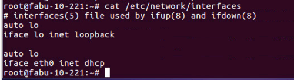](http://jingyan.baidu.com/album/7f41ecec5d6014593d095ce0.html?picindex=1)

2. 2

   编辑配置文件/etc/network/interfaces

   增加如下内容

   auto ens32iface ens32inet staticaddress 192.168.10.219netmask 255.255.255.128gateway 192.168.10.129broadcast 192.168.10.255

   [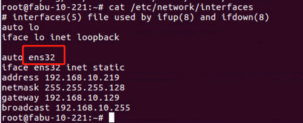](http://jingyan.baidu.com/album/7f41ecec5d6014593d095ce0.html?picindex=2)

3. 3

   配置dns，编辑配置文件/etc/resolv.conf，增加如下内容

   [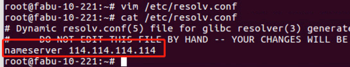](http://jingyan.baidu.com/album/7f41ecec5d6014593d095ce0.html?picindex=3)

4. 4

   ping域名进行测试

   [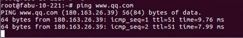](http://jingyan.baidu.com/album/7f41ecec5d6014593d095ce0.html?picindex=4)

5. 5

   为验证ip地址是否永久性，重启操作系统

   reboot

   [](http://jingyan.baidu.com/album/7f41ecec5d6014593d095ce0.html?picindex=5)

6. 6

   重启完系统之后公网ip地址通，但是域名不通

   [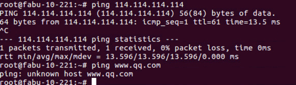](http://jingyan.baidu.com/album/7f41ecec5d6014593d095ce0.html?picindex=6)

7. 7

   重启系统或者网络后还是无效，编辑该文件

   vim /etc/resolvconf/resolv.conf.d/base

   增加nameserver 114.114.114.114

   [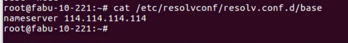](http://jingyan.baidu.com/album/7f41ecec5d6014593d095ce0.html?picindex=7)

8. 8

   如果还是无法上网，可以将/etc/NetworkManager/目录下的system-connections删除或者移动到其他目录下再重启网络或者系统即可

   [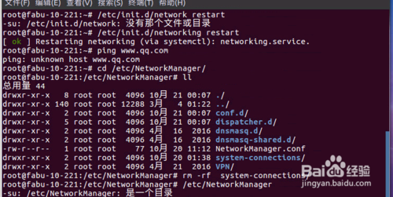](http://jingyan.baidu.com/album/7f41ecec5d6014593d095ce0.html?picindex=8)

   END

注意事项

- ubuntu重启网卡的命令为/etc/init.d/networking restart

## 4. rosbag code api（c++）

http://wiki.ros.org/rosbag/Code%20API

The `rosbag` C++ API works on the premise of creating "views" of one or more bags using "queries". A  Query is an abstract class which defines a function that filters whether or not the messages from a connection are to be included. This function has access to topic_name, datatype, md5sum, message definition as well  as the connection header. Additionally, each Query can specify a start  and end time for the range of times it includes. 

Multiple queries can be added to a View, including queries from different bags.  The View then provides an iterator interface across the bags, sorted  based on time. 

For more information, see the [C++ Code API](http://www.ros.org/doc/api/rosbag/html/c++/). 

Example usage for write: 

```cpp
   1     #include <rosbag/bag.h>
   2     #include <std_msgs/Int32.h>
   3     #include <std_msgs/String.h>
   4 
   5     rosbag::Bag bag;
   6     bag.open("test.bag", rosbag::bagmode::Write);
   7 
   8     std_msgs::String str;
   9     str.data = std::string("foo");
  10 
  11     std_msgs::Int32 i;
  12     i.data = 42;
  13 
  14     bag.write("chatter", ros::Time::now(), str);
  15     bag.write("numbers", ros::Time::now(), i);
  16 
  17     bag.close();
```

Example usage for read: 

```cpp
   1     #include <rosbag/bag.h>
   2     #include <rosbag/view.h>
   3     #include <std_msgs/Int32.h>
   4     #include <std_msgs/String.h>
   5 
   6     #include <boost/foreach.hpp>
   7     #define foreach BOOST_FOREACH
   8 
   9     rosbag::Bag bag;
  10     bag.open("test.bag", rosbag::bagmode::Read);
  11 
  12     std::vector<std::string> topics;
  13     topics.push_back(std::string("chatter"));
  14     topics.push_back(std::string("numbers"));
  15 
  16     rosbag::View view(bag, rosbag::TopicQuery(topics));
  17 
  18     foreach(rosbag::MessageInstance const m, view)
  19     {
  20         std_msgs::String::ConstPtr s = m.instantiate<std_msgs::String>();
  21         if (s != NULL)
  22             std::cout << s->data << std::endl;
  23 
  24         std_msgs::Int32::ConstPtr i = m.instantiate<std_msgs::Int32>();
  25         if (i != NULL)
  26             std::cout << i->data << std::endl;
  27     }
  28 
  29     bag.close();
```

Another C++ example, using C++11: 

```
   1     #include <rosbag/bag.h>
   2     #include <rosbag/view.h>
   3     #include <std_msgs/Int32.h>
   4 
   5     rosbag::Bag bag;
   6     bag.open("test.bag");  // BagMode is Read by default
   7 
   8     for(rosbag::MessageInstance const m: rosbag::View(bag))
   9     {
  10       std_msgs::Int32::ConstPtr i = m.instantiate<std_msgs::Int32>();
  11       if (i != nullptr)
  12         std::cout << i->data << std::endl;
  13     }
  14 
  15     bag.close();
```

### Analyzing Stereo Camera Data


Stereo camera data is stored on four separate topics: image topics for each camera [sensor_msgs/Image](http://docs.ros.org/api/sensor_msgs/html/msg/Image.html), and camera info topics for each camera [sensor_msgs/CameraInfo](http://docs.ros.org/api/sensor_msgs/html/msg/CameraInfo.html). In order to process the data, you need to synchronize messages from all four topics using a [message_filters::TimeSynchronizer](http://wiki.ros.org/message_filters#Time_Synchronizer).  

In this example, we're loading the entire bag file to memory before analyzing the images (as opposed to lazy loading). 

[rosbag cookbook](http://wiki.ros.org/rosbag/Cookbook#)

```cpp
   1 #include <ros/ros.h>
   2 #include <rosbag/bag.h>
   3 #include <rosbag/view.h>
   4 
   5 #include <boost/foreach.hpp>
   6 
   7 #include <message_filters/subscriber.h>
   8 #include <message_filters/time_synchronizer.h>
   9 
  10 #include <sensor_msgs/Image.h>
  11 #include <sensor_msgs/CameraInfo.h>
  12 
  13 // A struct to hold the synchronized camera data 
  14 // Struct to store stereo data
  15 class StereoData
  16 {
  17 public:
  18   sensor_msgs::Image::ConstPtr image_l, image_r;
  19   sensor_msgs::CameraInfo::ConstPtr cam_info_l, cam_info_r;
  20   
  21   StereoData(const sensor_msgs::Image::ConstPtr &l_img, 
  22              const sensor_msgs::Image::ConstPtr &r_img, 
  23              const sensor_msgs::CameraInfo::ConstPtr &l_info, 
  24              const sensor_msgs::CameraInfo::ConstPtr &r_info) :
  25     image_l(l_img),
  26     image_r(r_img),
  27     cam_info_l(l_info),
  28     cam_info_r(r_info)
  29   {}
  30 };
  31 
  32 /**
  33  * Inherits from message_filters::SimpleFilter<M>
  34  * to use protected signalMessage function 
  35  */
  36 template <class M>
  37 class BagSubscriber : public message_filters::SimpleFilter<M>
  38 {
  39 public:
  40   void newMessage(const boost::shared_ptr<M const> &msg)
  41   {
  42     signalMessage(msg);
  43   }
  44 };
  45 
  46 // Callback for synchronized messages
  47 void callback(const sensor_msgs::Image::ConstPtr &l_img, 
  48               const sensor_msgs::Image::ConstPtr &r_img, 
  49               const sensor_msgs::CameraInfo::ConstPtr &l_info,
  50               const sensor_msgs::CameraInfo::ConstPtr &r_info)
  51 {
  52   StereoData sd(l_img, r_img, l_info, r_info);
  53 
  54   // Stereo dataset is class variable to store data
  55   stereo_dataset_.push_back(sd);
  56 }
  57  
  58 // Load bag
  59 void loadBag(const std::string &filename)
  60 {
  61   rosbag::Bag bag;
  62   bag.open(filename, rosbag::bagmode::Read);
  63   
  64   std::string l_cam = image_ns_ + "/left";
  65   std::string r_cam = image_ns_ + "/right";
  66   std::string l_cam_image = l_cam + "/image_raw";
  67   std::string r_cam_image = r_cam + "/image_raw";
  68   std::string l_cam_info = l_cam + "/camera_info";
  69   std::string r_cam_info = r_cam + "/camera_info";
  70   
  71   // Image topics to load
  72   std::vector<std::string> topics;
  73   topics.push_back(l_cam_image);
  74   topics.push_back(r_cam_image);
  75   topics.push_back(l_cam_info);
  76   topics.push_back(r_cam_info);
  77   
  78   rosbag::View view(bag, rosbag::TopicQuery(topics));
  79   
  80   // Set up fake subscribers to capture images
  81   BagSubscriber<sensor_msgs::Image> l_img_sub, r_img_sub;
  82   BagSubscriber<sensor_msgs::CameraInfo> l_info_sub, r_info_sub;
  83   
  84   // Use time synchronizer to make sure we get properly synchronized images
  85   message_filters::TimeSynchronizer<sensor_msgs::Image, sensor_msgs::Image, sensor_msgs::CameraInfo, sensor_msgs::CameraInfo> sync(l_img_sub, r_img_sub, l_info_sub, r_info_sub, 25);
  86   sync.registerCallback(boost::bind(&callback, _1, _2, _3, _4));
  87   
  88   // Load all messages into our stereo dataset
  89   BOOST_FOREACH(rosbag::MessageInstance const m, view)
  90   {
  91     if (m.getTopic() == l_cam_image || ("/" + m.getTopic() == l_cam_image))
  92     {
  93       sensor_msgs::Image::ConstPtr l_img = m.instantiate<sensor_msgs::Image>();
  94       if (l_img != NULL)
  95         l_img_sub.newMessage(l_img);
  96     }
  97     
  98     if (m.getTopic() == r_cam_image || ("/" + m.getTopic() == r_cam_image))
  99     {
 100       sensor_msgs::Image::ConstPtr r_img = m.instantiate<sensor_msgs::Image>();
 101       if (r_img != NULL)
 102         r_img_sub.newMessage(r_img);
 103     }
 104     
 105     if (m.getTopic() == l_cam_info || ("/" + m.getTopic() == l_cam_info))
 106     {
 107       sensor_msgs::CameraInfo::ConstPtr l_info = m.instantiate<sensor_msgs::CameraInfo>();
 108       if (l_info != NULL)
 109         l_info_sub.newMessage(l_info);
 110     }
 111     
 112     if (m.getTopic() == r_cam_info || ("/" + m.getTopic() == r_cam_info))
 113     {
 114       sensor_msgs::CameraInfo::ConstPtr r_info = m.instantiate<sensor_msgs::CameraInfo>();
 115       if (r_info != NULL)
 116         r_info_sub.newMessage(r_info);
 117     }
 118   }
 119   bag.close();
 120 }
```

## 5. 强化学习

openai，ros

```
https://blog.csdn.net/ZhangRelay/article/details/91361113
```

## 6. 小组长 汇报工作

小组长 汇报工作大纲

关键工作（4月-12月）

汇总：

项目支持：阳程项目（开发，调试），京山差动轮项目（动态footprint，动态绕障），

愚公产品化：愚公重构，NTT，LPP，chassis

韩信产品化：TS提前下发，取消任务，navigator与performer平滑过渡，navigator轨迹末端精度提升

研发专项：

1）自动运动模型标定

2）绕障专项

培训：

带实习生熟悉navigator框架，日常培训交流，组织构建navigator的文档系统，新的debug工具。

管理：

日常管理分配组内工作，组织讨论和制定方案。