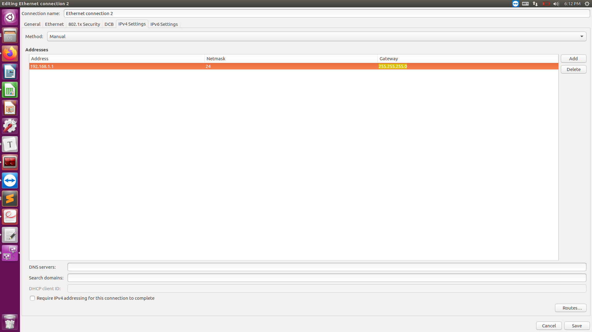

# 20191217

## 1. 测试SLAM产品化方法前期准备

### 1.pre install

```shell
sudo pip install python-socketio
sudo pip install requests
```

### 2. 网络配置

server


client



### 3.客户端代码设置

```python
import rospy
from nav_msgs.msg import Odometry
import socketio
import json

sio = socketio.Client()

topic_name = "/webslam/odom/filtered_test"
pub = rospy.Publisher(topic_name, Odometry, queue_size=10)
rospy.init_node('test', anonymous=True)


def connect():
    print("I'm connected!")


@sio.event
def disconnect():
    print("I'm disconnected!")


@sio.on('odomFilteredReply')
def my_message(data):
    msg = json.loads(data.get("msg"))
    new_msg = Odometry()
    new_msg.header.seq = msg.get("header").get("seq")
    new_msg.header.stamp.secs = msg.get("header").get("stamp").get("secs")
    new_msg.header.stamp.nsecs = msg.get("header").get("stamp").get("nsecs")
    new_msg.header.frame_id = str(msg.get("header").get("frame_id"))
    new_msg.child_frame_id = str(msg.get("child_frame_id"))
    new_msg.pose.pose.position.x = msg.get("pose").get("pose").get("position").get("x")
    new_msg.pose.pose.position.y = msg.get("pose").get("pose").get("position").get("y")
    new_msg.pose.pose.position.z = msg.get("pose").get("pose").get("position").get("z")
    new_msg.pose.pose.orientation.x = msg.get("pose").get("pose").get("orientation").get("x")
    new_msg.pose.pose.orientation.y = msg.get("pose").get("pose").get("orientation").get("y")
    new_msg.pose.pose.orientation.z = msg.get("pose").get("pose").get("orientation").get("z")
    new_msg.pose.covariance = msg.get("pose").get("covariance")
    new_msg.twist.twist.linear.x = msg.get("twist").get("twist").get("linear").get("x")
    new_msg.twist.twist.linear.y = msg.get("twist").get("twist").get("linear").get("y")
    new_msg.twist.twist.linear.z = msg.get("twist").get("twist").get("linear").get("z")
    new_msg.twist.twist.angular.x = msg.get("twist").get("twist").get("angular").get("x")
    new_msg.twist.twist.angular.y = msg.get("twist").get("twist").get("angular").get("y")
    new_msg.twist.twist.angular.z = msg.get("twist").get("twist").get("angular").get("z")
    new_msg.twist.covariance = msg.get("twist").get("covariance")
    print(new_msg)
    pub.publish(new_msg)


sio.connect('ws://192.168.120.110:8000')
sio.wait()
```

### 4.测试方法

录制两边的log

## 2. ros time转换．

