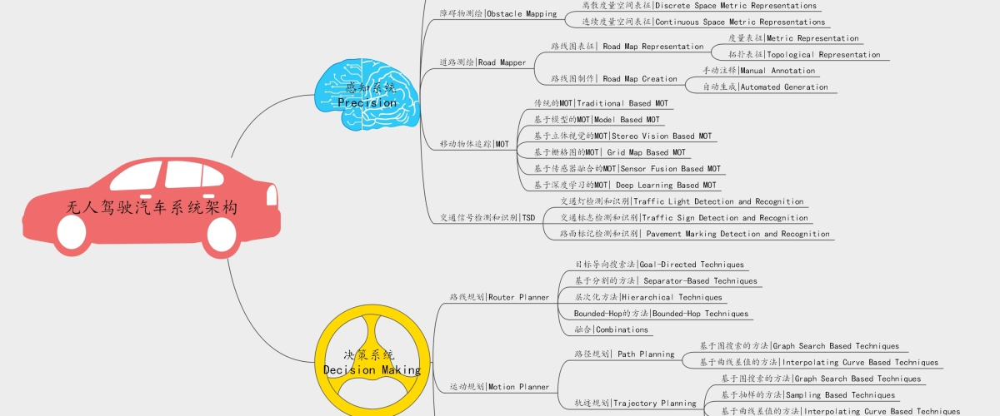
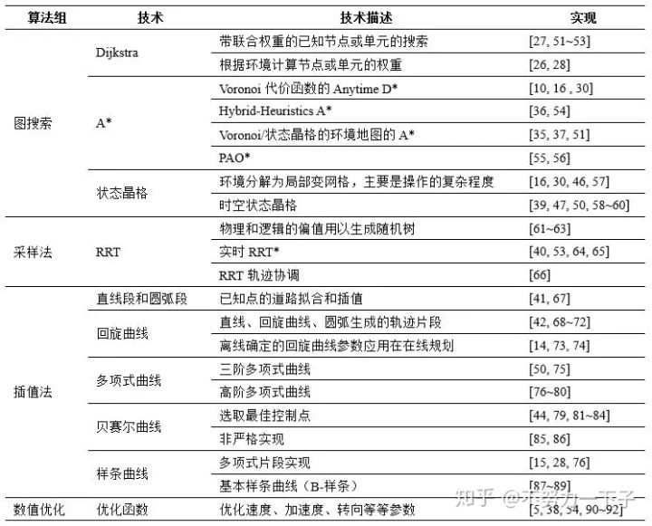

# 20191218

## 1. 蓝本会议纪要

| 版本 | 地点           | 参会人员                   | 时间       |
| ---- | -------------- | -------------------------- | ---------- |
| v1.0 | 上海紫竹办公室 | bito: 焦健, 吴天俊, 张振林 | 2019-12-18 |
|      |                | 蓝本:江浪江总,倪总         | 2019-12-18 |
|      |                |                            |            |

### 1.bito对蓝本要求:

安全性: 如果can不发数据, 希望底层可以停.增加双向心跳包.(1周内给协议, 12月25日)

实时性: 希望响应优先, 目前bito给驱动器的控制响应时间为1.7s, 希望可以到0.2s以内, 最差不要高于0.4s, 上层给驱动器发10hz.

灵敏度调整:舵轮的灵敏度更高.希望可以提高到0.1度.

死区性能测试: 低速前进和后退转向的时候, 是否会有卡死的情况.

提供给bito上层的基于电机的转速和反馈的数据.而不是车体速度的数据,可以把减速比,轮径等数据提供给bito,公式换算单位是m/s.

gcan(usb转can进行测试)提供给他们进行测试.

修改转向的值域, 转向反馈值(-1000,1000)(单位为0.1度)

最高速度限制在2m/s以内.

### 2.蓝本反馈:

舵轮角度保持特性: 达到一个角度30s以后, 会调整角度3-4度的情况.

## 2.云服务机器人

https://docs.aws.amazon.com/robomaker/latest/dg/sample-applications.html

一个简单案例

https://github.com/aws-robotics/aws-robomaker-sample-application-helloworld

博客

https://zhangrelay.blog.csdn.net/article/details/103258681

多机器人

http://wiki.ros.org/ROS/Tutorials/MultipleRemoteMachines

## 3.自动驾驶汽车：决策系统之运动规划Motion Plan

[Self-Driving Cars: A Survey](https://link.zhihu.com/?target=https%3A//arxiv.org/abs/1901.04407)

[arxiv.org](https://link.zhihu.com/?target=https%3A//arxiv.org/abs/1901.04407)

运动规划子系统负责计算从自动驾驶车的当前状态到由行为选择子系统定义的下一个局部目标状态的路径或轨迹。 运动计划执行本地驾驶行为，并满足汽车的运动以及动态约束，为乘客提供舒适性，同时也要避免与环境中的静态和移动障碍物碰撞。

运动规划可以是路径或轨迹。该路径是一系列汽车状态，并且没有定义汽车状态如何随时间演变。该任务也可以委托给其他子系统（如，行为选择子系统），或者速度分布可以定义为曲率和与障碍物的接近度的函数。轨迹是对汽车指定状态随时间演变的路径。

在文献中已经提出了各种运动规划方法。我们回顾那些专为道路运动规划而设计并使用实际自动驾驶车进行实验评估的方法。有关这些方法的更全面的评论，读者可以参考González等人[[GON16\]](https://link.zhihu.com/?target=https%3A//ieeexplore.ieee.org/document/7339478)和Paden等人[[PAD16\]](https://link.zhihu.com/?target=https%3A//arxiv.org/abs/1604.07446)的文章。 

1）路径规划

路径规划涉及到汽车从当前状态到下一个目标状态阶段生成的一系列状态，但这个状态不会定义汽车状态随时间的演变。路径规划通常分为全局路径规划和局部路径规划[[KAM04\]](https://link.zhihu.com/?target=http%3A//ieeexplore.ieee.org/document/1331052)。在全局路径规划中，在汽车开始之前，全局路径就已经通过离线地图计算好了。在局部路径规划中，在汽车移动过程中，通过使用周围环境的在线局部地图得到局部路径，这可以让汽车处理移动的障碍物。路径规划的方法可以主要分为两类：基于图搜索以及基于插值曲线[GON16，PAD16]。

a）基于图搜索的技术

基于图搜索的方法是在以图为特征的状态空间中搜索汽车的当前状态和下一个目标状态之间的最佳路径（状态序列）。它们将搜索空间表征为图形。他们将搜索空间离散化并在占据栅格地图上添加图形，其中单元中心充当搜索图中的邻边。用于自动驾驶汽车的路径规划的最常见的基于图搜索的技术是Dijkstra，A*以及A*变体。

Dijkstra算法[DIJ59]是通过找到图的初始节点和目标节点之间的最短路径。  Dijkstra算法通过重复检查最近尚未检查的节点，将其邻点添加到要检查的节点集，并在达到目标节点时停止。Dijkstra算法适用于全局路径规划。然而，由于检查的节点数量很多，它在大面积地区的计算成本很高，并且有时候结果不连续[GON16]。 Arnay等[[ARN16\]](https://link.zhihu.com/?target=https%3A//ieeexplore.ieee.org/document/7457728/)使用Dijkstra生成一条全局路径，该路径被扩展用于构建自动驾驶车辆“Verdino”的轨迹。Bacha等人[[BAC08\]](https://link.zhihu.com/?target=http%3A//www.romela.org/wp-content/uploads/2015/05/Odin-Team-VictorTango%E2%80%99s-Entry-in-the-DARPA-Urban-Challenge.pdf)使用Dijkstra算法为无人驾驶汽车Odin [[BAC08\]](https://link.zhihu.com/?target=http%3A//www.romela.org/wp-content/uploads/2015/05/Odin-Team-VictorTango%E2%80%99s-Entry-in-the-DARPA-Urban-Challenge.pdf)构建一条全局路径，以便向停车位导航并倒车。 Kala等人[KAL13]使用Dijkstra算法生成全局路径和局部路径，然而仅在计算机模拟中进行测试。

A*算法[HAR68]是Dijkstra的扩展，其主要通过基于对目标节点的启发式估计成本向节点分配权重来执行快速图搜索。然而，这种算法找到解决方案并不容易[GON16]。 Leedy等人[[LEE07\]](https://link.zhihu.com/?target=https%3A//link.springer.com/chapter/10.1007/978-3-540-73429-1_5)采用A*算法为无人驾驶汽车“Rocky”建立局部路径，参与了2005年DARPA大挑战赛。Ziegler等人[[ZIE08\]](https://link.zhihu.com/?target=https%3A//ieeexplore.ieee.org/iel5/4607789/4621124/04621302.pdf)提出了一种局部路径规划方法，该方法将A*算法与两种不同的启发式成本函数相结合，即（RTR）度量和Voronoi。其中第一个考虑了汽车的运动学约束，而第二个考虑了障碍物的形状和位置的常识。该方法在机车“AnnieWAY”中进行了测试，该车参加了2007年DARPA城市挑战赛。

其他作者提出了用于路径规划的A*算法的变体。  Urmson等[URM08]为无人驾驶汽车“Boss”（卡内基梅隆大学的汽车在2007年DARPA城市挑战赛中获得第一名）提出任意时刻D*。Dolgov等人[DOL10]为无人驾驶车“Junior”[MON08]（斯坦福大学的汽车在2007年DARPA城市挑战赛中获得第二名）提出了混合动力A*。任何时候D*和混合状态A*的算法都会合并两个启发式算法：一个是非完整的，因为它忽略了障碍物；另一个则是完整的，因为它考虑了障碍物，并用于非结构化环境（停车场）中的路径规划。Chu等人[[CHU15\]](https://link.zhihu.com/?target=https%3A//link.springer.com/article/10.1007/s12239-015-0067-5)提出了A*的变体来建立考虑汽车运动学约束的局部路径，通过忽略了网格单元的分辨率并创建了平滑的路径。 Yoon等人[[YOO15\]](https://link.zhihu.com/?target=https%3A//ieeexplore.ieee.org/document/7101249/)提出了一种A*的变体，该方法用于自动驾驶车“Kaist”的运动学限制。

b）基于曲线插值的方法

基于曲线插值的方法是通过使用插值处理。该方法通过插值处理在之前已知的点集的范围内插入新的点集。方法采用之前已知的一组点（如，描述路线图的航点）并生成描绘更平滑路径的新点集。用于自动驾驶汽车的路径规划的最常用曲线插值的方法是是样条曲线。

样条曲线是以子间隔划分为分段多项式参数曲线，这些曲线可以将其定义为多项式曲线。每个子段之间的连接称为结（或控制点），其通常具有高度平滑约束。这种曲线具有较低的计算成本，因为其行为是由结来定义的。然而，这种方法的结果可能不是最优的，因为它更侧重于实现部件之间的连续性而不是满足道路的约束，并且它取决于全局航路点[GON16]。Chu等人[[CHU12\]](https://link.zhihu.com/?target=https%3A//ieeexplore.ieee.org/document/6203588)和胡等人[[HU18\]](https://link.zhihu.com/?target=https%3A//www.sciencedirect.com/science/article/pii/S0888327017303825)使用三次样条曲线进行路径规划。他们的方法都构成了从车道地图获得的一组航路点的中心线，并且生成一系列三次样条的参数。这些三次样条参数通过使用弧长和偏移到中心线来表示可能的路径候选。其中，最佳路径通过基于功能成本的加权和来选择。这两种方法之间的区别在于：第一种方法仅避免静态障碍，而第二种既可以避免静态也能避免移动障碍。另一个不同之处在于，第一个是在自动驾驶汽车“A1”(在2010年赢得了韩国的自动驾驶汽车竞赛)上测试的，而第二个则通过计算机模拟评估，模拟了具有挑战性的情景，包括单车道和多车道有静止和移动障碍的道路。

2）轨迹规划

轨迹规划涉及自动驾驶车从当前状态到下一个目标状态（该状态详细说明了汽车状态随时间的变化过程）生成一系列状态。轨迹规划的方法可以主要分为四类：基于图搜索、基于采样、基于插值曲线以及基于数值优化[GON16，PAD16]。

a）基于图搜索的技术

用于轨迹规划的基于图搜索的技术扩展了用于路径规划的技术（第4.2.1节），以用来详细说明汽车状态随时间的变化过程。在自动驾驶汽车中，最常见的基于图搜索的轨迹规划方法是状态点阵、弹性带（EB）和A*。

状态点阵是一种搜索图，该搜索图的顶点表示状态，边表示连接满足设备运动约束的状态的路径。顶点以常规方式放置，并使得相同的路径可用于连接所有顶点。通过这种方式，到目标的路径可能通过图中的一系列边来展示。仅通过表征解决方案中的可能状态，该状态网格必须适合于在线路径规划。此外，该方法必须通过添加时间和速度维度将这种“状态晶格”扩展到动态环境。状态格子能够处理多个维度，例如位置，速度和加速度，并且适用于局部规划和动态环境。但是，它们具有很高的计算成本，因为它会评估图中的每个可能的解决方案[GON16]。McNaughton等人[[MCN11\]](https://link.zhihu.com/?target=https%3A//ieeexplore.ieee.org/document/5980223/)提出了一种用于道路轨迹规划的共形时空状态格。他们在方法中围绕中心线路径构建状态网格，在距离中心线的横向偏移处定义道路上的节点，并使用优化算法计算节点之间的边缘。该优化算法找到定义连接任何节点对的边的多项式函数的参数。他们为每个节点分配一个状态向量，其中包含姿势、加速度曲线以及时间和速度范围。通过时间和速度间隔的更精细离散化相比，加速度曲线以更低的成本增加轨迹多样性。此外，时间和速度的范围通过允许将时间和速度分配给图搜索阶段而不是图构建阶段来降低计算成本。Xu等人[[XU12\]](https://link.zhihu.com/?target=https%3A//ieeexplore.ieee.org/abstract/document/6225063/)提出了一种迭代优化的方法，该迭代优化应用于从状态点阵导出的合成轨迹，以用来减少规划的时间并改善了轨迹质量。Gu等人[[GU16\]](https://link.zhihu.com/?target=https%3A//www.ri.cmu.edu/publications/automated-tactical-maneuver-discovery-reasoning-and-trajectory-planning-for-autonomous-driving/)提出了一种将状态晶格轨迹规划与行为选择融合的规划方法。该方法对一组候选轨迹进行采样，并从中提取不同的行为。通过选择行为并选择与所选行为相关联的候选轨迹来获得最终轨迹。Li等人[[LI16\]](https://link.zhihu.com/?target=https%3A//ieeexplore.ieee.org/document/7303933)使用三次多项式曲线沿全局路径生成候选路径，此外通过计算速度分布对所生成的路径的点进行分配，并通过成本函数评估所生成的轨迹，并选择最佳轨迹。

在路径规划方法中，基于弹性带方法的优化是通过具有弹性节点和边缘的图表来表征状态空间。通过用连接相邻空间节点的内外边缘对空间节点进行扩充来定义弹性节点。路径是通过优化算法获取。其中优化算法平衡两种力:外部障碍产生的排斥力以及消除带松弛的相邻点所产生的收缩力。该方法展示了连续性和稳定性，具有非确定性的运行时间并且需要无冲突的初始路径。

Gu等人[[GU15\]](https://link.zhihu.com/?target=http%3A//ri.cmu.edu/pub_files/2015/9/20150301-IROS-Tianyu.pdf)提出了一种解耦的时空轨迹规划方法，该方法对路径规划和轨迹规划进行分别执行。轨迹规划分为三个阶段：在第一阶段，考虑道路和障碍物约束来计算无碰撞路径，并且使用纯追踪控制器和运动学汽车模型生成可行路径；在第二阶段，在几个约束（速度限制、障碍物接近、横向加速度和纵向加速度）下给出速度分布；最后，给定路径和速度分布，通过参数路径螺旋计算轨迹。通过模拟未来的运动，算法可以对所有静态和移动障碍物进行轨迹评估。 A*算法通常用于路径规划（第4.2.1节）或非结构化轨迹规划。 道路轨迹规划，Fassbender等[[FAS16\]](https://link.zhihu.com/?target=http%3A//ieeexplore.ieee.org/document/7759692/)对A*提出了两种新的节点扩展方案。第一种方案通过数值优化来试图找到汽车从当前节点直接连接到目标节点的轨迹。第二种方案使用纯追踪控制器去在沿着全局参考路径上，生成引导汽车的短边（即，短运动基元）。

b）基于抽样的方法

基于采样的方法是通过随机地对状态空间进行采样来寻找汽车当前状态和下一个目标状态之间的连接。在自动驾驶汽车轨迹规划中，最常用的基于采样的方法是快速探索随机树（RRT）。

用于轨迹生成的RRT方法[[LAV01\]](https://link.zhihu.com/?target=https%3A//journals.sagepub.com/doi/10.1177/02783640122067453)使用来自状态空间的随机样本将汽车从当前状态进行递增，以用来构建搜索树。在每个随机状态，控制命令应用在树的最近顶点，以用来创建尽可能接近随机状态的新状态。其中树的每个顶点表示一个状态，每个有向边表示一个用于扩展状态的命令。候选轨迹通过各种标准进行评估。RRT方法对于高维空间具有较低的计算成本，并且只要解存在，总是找到解决方案，但需要算法给予足够的时间。然而，它的结果并不是连续而且不稳定[GON16]。 Radaelli等[[RAD14\]](https://link.zhihu.com/?target=https%3A//link.springer.com/chapter/10.1007/978-3-319-12027-0_38)提出了一种用于无人驾驶车“IARA”的轨迹规划的RRT方法。它们为标准RRT方法提供了新的变体，该变体方法用来将随机状态的位置偏向车道区域，选择最有希望的控制命令来扩展状态，选择最佳轨迹，丢弃非有希望状态，并重新使用部分在在之前的规划周期内构建的轨迹。Du等人[[DU16\]](https://link.zhihu.com/?target=https%3A//www.ncbi.nlm.nih.gov/pubmed/26784203)提出了一种RRT方法，该方法通过使用驾驶员在道路上的视觉搜索行为来指导RRT的状态采样。驾驶员在进行转弯过长中会使用“近点”和“远点”。他们利用弯道上显示的驾驶员视觉搜索行为的这一特征来指导RRT方法。此外，他们采用基于B样条的后处理方法来生成平滑、连续和可行的轨迹。

c）基于曲线的插值方法

基于插值曲线的方法通过内插先前已知的一组点（如，道路地图路点）并且构建更平滑的轨迹。该轨迹同时考虑汽车的运动和动态约束、舒适度、障碍物以及其他参数。在自动驾驶汽车的轨迹规划中最常见的基于内插曲线的技术是回旋曲线。

回旋曲线允许定义具有线性可变曲率的轨迹，以便直线段到弯曲段之间的过渡是平滑的。然而，由于通过积分方法来定义，因此回旋曲线具有高计算成本，并且它取决于全局航路点[GON16]。 Alia等[[ALI15\]](https://link.zhihu.com/?target=https%3A//ieeexplore.ieee.org/document/7225762/)使用回旋触角进行轨迹规划。从汽车的重心开始，采用回旋曲线的形式，根据不同的速度和不同的初始转向角来计算出触角。使用占据栅格图将触角分类为可导航或不可导航。在可通航的触角中，最好的触手是根据几个标准选择的。 Mouhagir等[[MOU16\]](https://link.zhihu.com/?target=https%3A//ieeexplore.ieee.org/document/7795696/) [[MOU17\]](https://link.zhihu.com/?target=https%3A//hal.archives-ouvertes.fr/hal-01556594/document)也使用回旋触手进行轨迹规划。然而，他们使用使用马尔可夫决策过程启发的方法来选择最佳触手。

d）基于数值优化的方法

基于数值优化的方法是将约束变量的函数最小化或最大化的过程。在自动驾驶汽车轨迹规划中，最常见的基于数值优化的技术是函数优化和模型预测方法。

函数优化方法是在考虑轨迹约束(如位置，速度，加速度和加加速度）下最小化成本函数来找到轨迹。这些方法可以很容易地考量汽车的运动学和动力学约束以及环境的约束。然而，由于在每个运动状态中都需要进行优化，并且取决于全局航路点，因此这种方法具有高计算成本[GON16]。Ziegler等人[[ZIE14b\]](https://link.zhihu.com/?target=https%3A//ieeexplore.ieee.org/document/6856581)使用功能优化方法对自动驾驶汽车“Bertha”进行轨迹规划。他们通过最小化成本函数并遵守轨迹约束。找到最佳轨迹。成本函数由一组项组成：使轨迹以指定的速度驾驶通道的中间行驶，对强加速度进行惩罚，抑制加速度的快速变化，并衰减高偏航率。

用于轨迹规划的模型预测方法[[HOW07\]](https://link.zhihu.com/?target=https%3A//journals.sagepub.com/doi/10.1177/0278364906075328)是通过对汽车从当前状态和下一个目标状态之间产生动态可行的控制命令。它们可用于解决生成满足状态约束的参数化控制命令的问题，其中动态可由微分方程表示。Ferguson等人[[FER08\]](https://link.zhihu.com/?target=http%3A//www.cs.cmu.edu/~maxim/files/motplaninurbanenv_part1_iros08.pdf)使用模型预测方法对自动驾驶汽车“Boss”[URM08]进行轨迹规划。该方法可以生成到从中心线路径导出的一组目标状态的轨迹。为了计算每个轨迹，他们使用优化算法逐渐修改轨迹控制参数的初始近似，直到轨迹终点误差在可接受的界限内。轨迹控制参数包括轨迹长度以及定义曲率轮廓的样条曲线的三个结点。基于若干因素（如，当前道路的速度极限，最大可行速度和目标状态速度）为每个轨迹生成的速度分布。并根据它们与障碍物的距离、到中心线路径的距离、平滑度、终点误差和速度误差来选择最佳轨迹。Li等人[[LI17\]](https://link.zhihu.com/?target=https%3A//www.sciencedirect.com/science/article/pii/S0888327015004811)使用基于状态采样的轨迹规划方案，该方案在全局参考路径中对目标状态进行采样，并应用模型预测路径规划方法来产生将汽车从当前状态连接到采样目标状态的路径。速度曲线用于为生成路径的每个状态进行分配速度。考虑安全性和舒适性的成本函数用于选择最佳轨迹。 Cardoso等[[CAR17\]](https://link.zhihu.com/?target=https%3A//arxiv.org/abs/1611.04552)使用模型预测方法进行自动驾驶车辆“IARA”的轨迹规划。为了计算轨迹，他们使用优化算法来找到轨迹控制参数，该轨迹控制参数在到目标状态的距离，到中心线路径的距离以及与障碍物的接近度进行最小化优化。其中轨迹控制参数包括轨迹时间和四个结点（指定转向角轮廓的样条曲线）。

对比图片来自：[自动驾驶汽车的运动规划技术综述](https://link.zhihu.com/?target=https%3A//mp.weixin.qq.com/s/L0Ti9wUCjE02XX7n18UfUQ)

------

## 4. rsync 远程更新同步

比较全的解释.

https://www.cnblogs.com/george-guo/p/7718515.html

**一、简介**

**1、认识**

Rsync（remote synchronize）是一个远程数据同步工具，可通过LAN/WAN快速同步多台主机间的文件。Rsync使用所谓的“Rsync算法”来使本地和远 程两个主机之间的文件达到同步，这个算法只传送两个文件的不同部分，而不是每次都整份传送，因此速度相当快

Rsync支持大多数的类Unix系统，无论是Linux、Solaris还是BSD上都经过了良好的测试

此外，它在windows平台下也有相应的版本，如cwRsync和Sync2NAS等工具

**2、原理**

Rsync本来是用于替代rcp的一个工具，目前由rsync.samba.org维护，所以rsync.conf文件的格式类似于samba的主配 置文件；Rsync可以通过rsh或ssh使用，也能以daemon模式去运行

在以daemon方式运行时Rsync server会打开一个**873 端口，等待客户端去连接。连接时，Rsync server会检查口令是否相符，若通过口令查核，则可以开始进行文件传输。第一次连通完成时，会把整份文件传输一次，以后则就只需进行增量备份**

**3、特点**

1、可以镜像保存整个目录树和文件系统；

2、可以很容易做到保持原来文件的权限、时间、软硬链接等；

3、无须特殊权限即可安装；

4、优化的流程，文件传输效率高；

5、可以使用rsh、ssh等方式来传输文件，当然也可以通过直接的socket连接；

6、支持匿名传输

**二、ssh模式**

**1、本地间同步**

**环境： 172.16.22.12**

\# mkdir src

\# touch src/{1,2,3,4}

\# mkdir dest

\# rsync -av src/ dest/ --将 src 目录里的所有的文件同步至 dest 目录（不包含src本身）

\# rsync -av src dest/ --将 src 目录包括自己整个同步至 dest 目录

\# rsync -avR src/ dest/ --即使 src 后面接有 / ，效果同上

**2、局域网间同步**

**环境： 172.16.22.11**

\# mkdir src

\# touch src/{a,b,c,d}

\# mkdir dest

\# rsync -av 172.16.22.12:/data/test/src/ dest/ --远程同步至本地，需输入root密码

\# rsync -av **src/ 172.16.22.12:/data/test/dest/ --本地文件同步至远程**

\# rsync -av **src 172.16.22.12:/data/test/dest/ --整个目录同步过去**

\# rm -rf src/d --删除一个文件 d

\# rsync -av **--delete src/ 172.16.22.12:/data/test/dest/ \**--delete，从目标目录里面删除无关的文件\****

**3、局域网指定用户同步**

**--172.16.22.12**

\# useradd george

\# passwd george

\# mkdir /home/george/test

\# touch /home/george/test/g{1,2,3,4}

**--172.16.22.11**

\# rsync -av src '-e ssh -l george' 172.16.22.12:/home/george --本地同步至远程

\# rsync -av 172.16.22.12:/home/george/test/g* '-e ssh -l george -p 22' dest/

 

**三、daemon模式**

**环境：192.168.22.11**

**1、服务启动方式**

1.1、对于负荷较重的 rsync 服务器应该使用**独立运行方式**

\# yum install rsync xinetd --服务安装

\# /usr/bin/rsync --daemon

1.2、对于负荷较轻的 rsync 服务器可以**使用 xinetd 运行方式**

\# yum install rsync xinetd --服务安装

\# vim /etc/xinetd.d/rsync --配置托管服务，将下项改为 no

disable = no

\# /etc/init.d/xinetd start --启动托管服务 xinetd

\# chkconfig rsync on

\# netstat -ntpl | grep 873 --查看服务是否启动

 

**2、配置详解**

两种 rsync 服务运行方式都需要配置 rsyncd.conf，其格式类似于 samba 的主配置文件

**全局参数**

在全局参数部分也可以定义模块参数，这时该参数的值就是所有模块的默认值

address --在独立运行时，用于指定的服务器运行的 IP 地址；由 xinetd 运行时将忽略此参数，使用命令行上的 –address 选项替代。默认本地所有IP

port --指定 rsync 守护进程监听的端口号。 由 xinetd 运行时将忽略此参数，使用命令行上的 –port 选项替代。默认 873

motd file --指定一个消息文件，当客户连接服务器时该文件的内容显示给客户

pid file --rsync 的守护进程将其 PID 写入指定的文件

log file --指定 rsync 守护进程的日志文件，而不将日志发送给 syslog

syslog facility --指定 rsync 发送日志消息给 syslog 时的消息级别

socket options --指定自定义 TCP 选项

lockfile --指定rsync的锁文件存放路径

timeout = 600 --超时时间

**模块参数**

模块参数主要用于定义 rsync 服务器哪个目录要被同步。模块声明的格式必须为 [module] 形式，这个名字就是在 rsync 客户端看到的名字，类似于 Samba 服务器提供的共享名。而服务器真正同步的数据是通过 path 来指定的

**基本模块参数**

path --指定当前模块在 rsync 服务器上的同步路径，该参数是必须指定的

comment --给模块指定一个描述，该描述连同模块名在客户连接得到模块列表时显示给客户

**模块控制参数**

use chroot = --默认为 true，在传输文件之前首先 chroot 到 path 参数所指定的目录下；优点，安全；缺点，需要 root 权限，不能备份指向 path 外部的符号连接所指向的目录文件

uid = --指定该模块以指定的 UID 传输文件；默认nobody

gid = --指定该模块以指定的 GID 传输文件；默认nobody

max connections --最大并发连接数，0为不限制

lock file --指定支持 max connections 参数的锁文件。默认 /var/run/rsyncd.lock

list --指定当客户请求列出可以使用的模块列表时，该模块是否应该被列出。默认为 true，显示

read only = --只读选择，也就是说，不让客户端上传文件到服务器上。默认true

write only = --只写选择，也就是说，不让客户端从服务器上下载文件。默认false

ignore errors --忽略IO错误。默认true

ignore nonreadable --指定 rysnc 服务器完全忽略那些用户没有访问权限的文件。这对于在需要备份的目录中有些不应该被备份者获得的文件时是有意义的。 false

timeout = --该选项可以覆盖客户指定的 IP 超时时间。从而确保 rsync 服务器不会永远等待一个崩溃的客户端。对于匿名 rsync 服务器来说，理想的数字是 600（单位为秒）。 0 (未限制)

dont compress --用来指定那些在传输之前不进行压缩处理的文件。该选项可以定义一些不允许客户对该模块使用的命令选项列表。必须使

