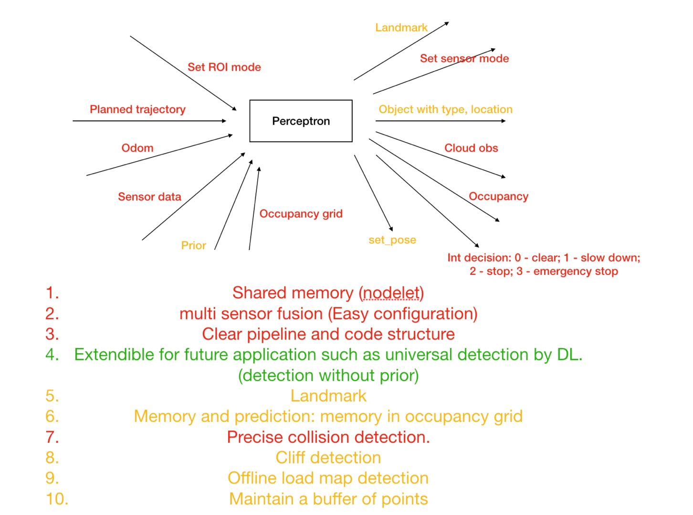
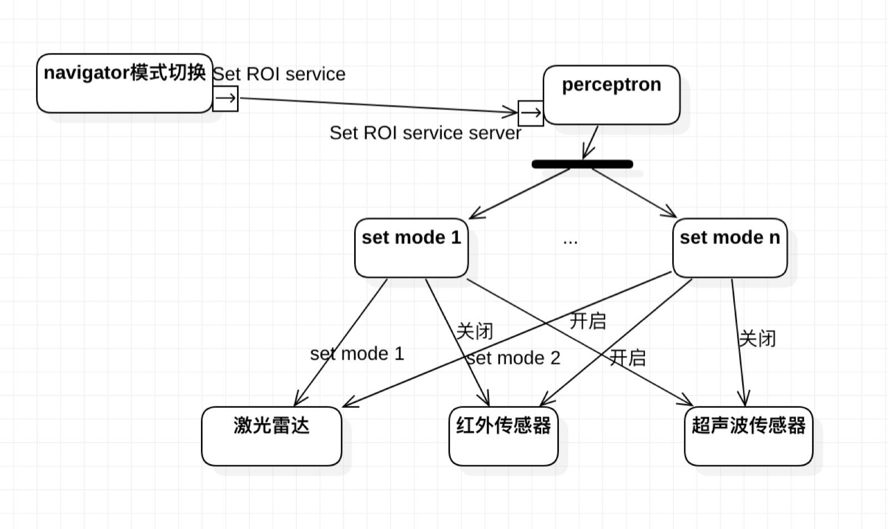

# 20191225_Set_ROI_mode设计方案

| Version | Author | Date       |
| ------- | ------ | ---------- |
| v1.0    | 焦健   | 2019-12-25 |
|         |        |            |
|         |        |            |


## 1. 背景

本说明文档是根据运动规划组与感知组讨论的perceptron架构图延伸出来的set roi mode的接口设计文档. 该文档由jimmy初次设计, 由代津与感知组进行审阅.感知组的perceptron架构图如下:



前期讨论如下: [20191224_perceptron的架构与运功规划组需要配合的内容.pdf](20191224_perceptron的架构与运功规划组需要配合的内容.pdf) 

## 2. Set ROI mode设计方案

由根据不同的工况和任务状态, navigator向perceptron发送set ROI mode的service, 该service只需要定义ROI mode模式, perceptron读取预先在yaml/json中存储的传感器相关的配置文件, 然后对相应的传感器进行处理.

### 2.1 数据结构说明

1) set ROI mode的service

名称: /yg../perceptron/set_roi_mode

type: bito_msgs/SetDetectionFieldSrv(可以讨论)

```shell
string param_name
# right now use 9 for low speed, 10 for high speed.
int8 command

---

bool confirm
```

2) json文件格式设计(perceptron内部设计)

ROI_mode json

```json
{
    "mode":{
	    [
	    	{ // mode 0
				"detection_lidar": {
					[
					{
						...//detection_lidar 0
					},
					{
						...//detection_lidar 1
					},
					...
					]
			    },
				"IR": {
					[
					{
						...// IR 0
					},
					{
						...// IR 1
					},
					...
					]
				},
				"ultrasonic": {
					[
					{
						...// ultrasonic 0
					},
					{
			            ...// ultrasonic 1
					},
			        ...
					]
				}
			},
			{	// mode 1
				"detection_lidar": {
					[
					{
						...//detection_lidar 0
					},
					{
						...//detection_lidar 1
					},
					...
					]
			    },
				"IR": {
					[
					{
						...// IR 0
					},
					{
						...// IR 1
					},
					...
					]
				},
				"ultrasonic": {
					[
					{
						...// ultrasonic 0
					},
					{
			            ...// ultrasonic 1
					},
			        ...
					]
				}
			},
			{ // mode 2
			 ...
			},
			...
			{ // mode n
			 ...
			}
		]
	}
}
```

### 2.2 流程图


